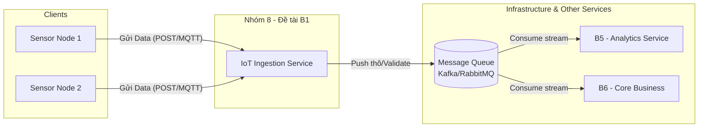

# Service Boundary của nhóm

## 1. Thông tin nhóm

- Tên nhóm: 8
- Lớp: CNTT-1708
- Thành viên: 
  1. Phan Lưu Phong
  2. Trần Phong
  3. Ngô Văn Quân
  4. Trần Thanh Bình
- Service nhóm phụ trách: IoT Ingestion (Xây dựng dịch vụ tiếp nhận dữ liệu IoT).
- Sản phẩm tổng thể của lớp: Product B (Hệ thống IoT tổng thể).

## 2. Actor

Ai tương tác với hệ thống/service?
- Các thiết bị IoT (IoT Devices / Sensors / Edge gateways) gửi dữ liệu đo đạc liên tục lên hệ thống.
- Admin/Kỹ sư hệ thống (giám sát tình trạng luồng dữ liệu truyền vào).

## 3. System Boundary

Nhóm em xây phần nào?

Phần nhóm kiểm soát:
- Các Endpoint (API hoặc MQTT Broker) tiếp nhận luồng dữ liệu (telemetry data) từ thiết bị.
- Logic kiểm tra tính hợp lệ của dữ liệu (Data Validation).
- Component đẩy dữ liệu thô (raw data) vào Message Queue (ví dụ: Kafka, RabbitMQ) hoặc Time-series Database.
- ...

Phần nhóm chỉ tích hợp:
- Dịch vụ quản lý/xác thực thiết bị (nếu cần check token/key của thiết bị).
- Các service tiêu thụ dữ liệu phía sau (Analytics, Core Business) do các nhóm khác (B5, B6) phụ trách.
- ...

## 4. Service Boundary

Service của nhóm có trách nhiệm gì?
- Lắng nghe và tiếp nhận dữ liệu từ hàng ngàn thiết bị IoT gửi về theo thời gian thực.
- Xác thực định dạng payload (ví dụ: JSON có đúng cấu trúc, có đủ trường `device_id`, `timestamp`, `value` không).
- Đảm bảo tính sẵn sàng cao, không làm mất mát dữ liệu khi có lượng kết nối lớn (high throughput).
- Định tuyến dữ liệu thô xuống các hàng đợi (Message Queue) để các service khác xử lý tiếp.
Service KHÔNG làm gì?
- KHÔNG phân tích, tính toán hay tổng hợp dữ liệu (Trách nhiệm của nhóm B5 - Analytics).
- KHÔNG xử lý các nghiệp vụ cốt lõi hay ra quyết định (Trách nhiệm của nhóm B6 - Core Business).
- KHÔNG trực tiếp gửi email/tin nhắn cảnh báo cho người dùng (Trách nhiệm của nhóm B7 - Notification).
## 5. Input / Output

### Input
- Gói tin (Payload) từ thiết bị IoT.
  - *Ví dụ:* `{"device_id": "sensor_01", "temperature": 25.4, "humidity": 60, "timestamp": 1715150000}`
- Giao thức: HTTP/HTTPS hoặc MQTT.
- ...

### Output
- Phản hồi trạng thái nhận dữ liệu thành công cho thiết bị (HTTP 200 OK hoặc MQTT ACK).
- Stream dữ liệu đã được làm sạch/định dạng chuẩn đẩy vào Message Queue/Database.
- ...

## 6. API dự kiến

| Method | Endpoint | Mục đích |
|---|---|---|
| GET | /health | Kiểm tra tình trạng hoạt động của Ingestion Service |
| POST | /api/v1/telemetry | Endpoint RESTful để thiết bị IoT gửi dữ liệu lên |
| (MQTT) | Topic: `devices/+/telemetry` | Kênh lắng nghe dữ liệu qua giao thức MQTT (nếu có dùng) |

## 7. Phụ thuộc service khác

Service này gọi đến service nào?
- Identity/Device Management Service (để kiểm tra xem thiết bị gửi dữ liệu có hợp lệ/được phép không - nếu kiến trúc yêu cầu).
- Message Broker (Kafka/RabbitMQ) để đẩy dữ liệu vào.
Service nào gọi đến service này?
- Thiết bị IoT (Client) gọi trực tiếp đến service này.
- Analytics Service (B5) và Core Business (B6) sẽ "lắng nghe" (consume) dữ liệu từ Queue mà Ingestion đẩy vào, thay vì gọi trực tiếp qua API.
## 8. Sơ đồ minh họa

Có thể vẽ bằng Mermaid, draw.io, Ludichart hoặc ảnh chụp sơ đồ.

